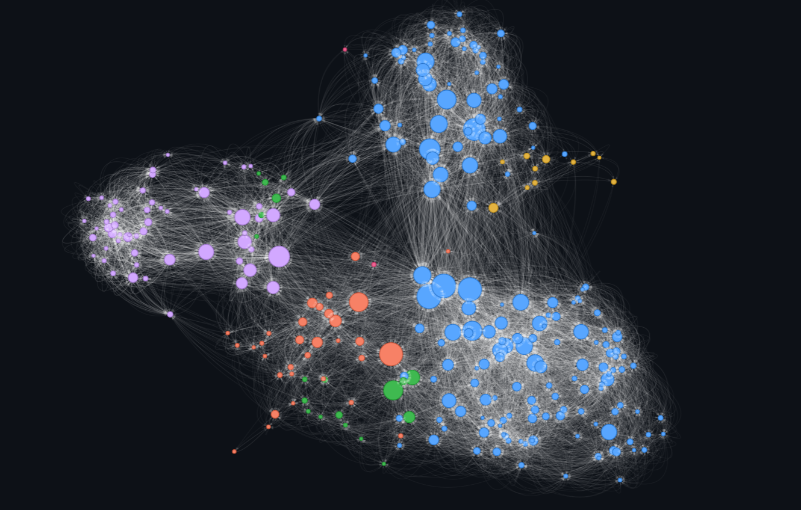
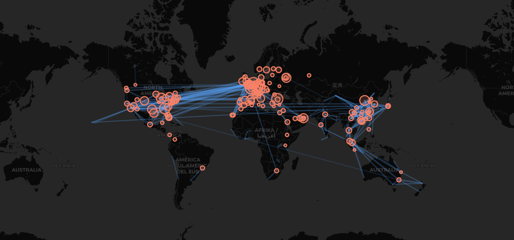
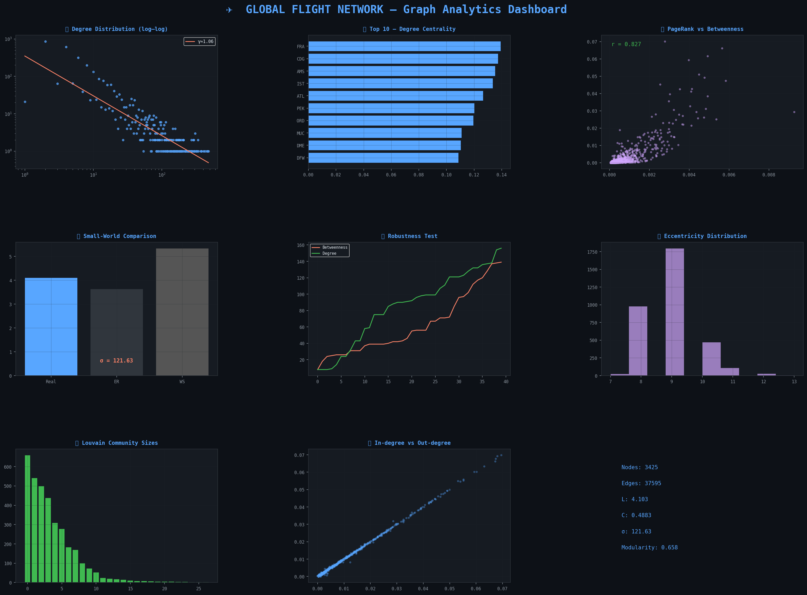

✈️ **How Connected is the World? A Deep Dive into the Global Flight Network**

I recently analyzed the global airline route network using graph theory and network science. The goal was to: understand the hidden structure that connects our world and uncover its strengths and vulnerabilities.

📊 **Data source**  
- OpenFlights.org (`airlines.dat`, `routes.dat`)  >>> [OpenFlights](https://openflights.org/data.php)
- Contains 67,663 routes between 3,425 airports, operated by 548 airlines  
- Snapshot from 2014 (routes data frozen since then—still the most comprehensive public dataset of its kind)

🔧 **What I did**  
Built a weighted directed graph where edges represent routes, and weights reflect the number of airlines flying that route.  
Applied:
- Centrality measures (Degree, Betweenness, PageRank)
- Community detection (Louvain)
- Small-world analysis (Watts–Strogatz model)
- Robustness testing (targeted node removal)

📈 **Key findings**
 - Average path length: only 4.1 hops between any two airports 
 - High clustering (C = 0.49) → strong regional groups with surprisingly short global connections 
 - A few hubs (FRA, CDG, AMS, IST, ATL) dominate connectivity 
 - This structure is robust against random failures but fragile under targeted attacks 
 - Louvain algorithm reveals [27 cohesive groups (modularity = 0.66)] geographic & economic blocks 
 - Modularity this high means most flights stay within regions
 - Degree hubs: Frankfurt, Paris CDG, Amsterdam 
 - Betweenness bridges: Anchorage (ANC) emerges as a critical trans‑Pacific connector 
 - PageRank influencers: Atlanta (ATL), Chicago (ORD), Los Angeles (LAX) – the most "important" nodes when considering route multiplicity
 - Removing just a few key nodes (like ANC, LAX, or CDG) could fragment the network dramatically 
 - Betweenness‑based attacks break the graph faster than degree‑based attacks

🧠 **What this means**  
The global flight network is a textbook example of a **scale‑free small‑world network**: efficient, clustered, but fragile at its core.

#DataScience #NetworkAnalysis #GraphTheory #Python #OpenFlights #ComplexNetworks #Aviation #DataVisualization #SmallWorld #ScaleFree #PyVis #Folium #TransportationAnalytics #MachineLearning #BigData
